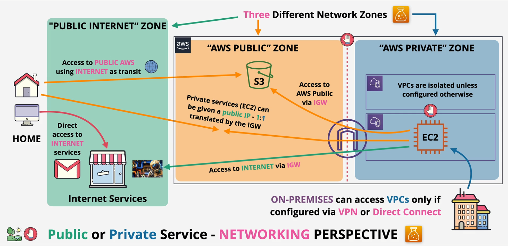

# AWS Fundamentals

## Public vs private

- AWS has three network zones
  - Public internet zone
    - used as transit to get to AWS public zone
  - Public zone
    - S3
  - Private zone
    - Private resources are within a VPC (virtual private cloud)
      - cannot communicate with other VPCs unless allowed
      - cannot access internet or be accessed by internet unless allowed
    - Private IP ranges
    - access public internet and public zone via internet gateway (IGW)

## Global infrastructure

- Most services are regional, some are global
- Service resilience
  - Globally resilient: data is replicated across multiple regions, cannot choose a region
    - e.g. IAM, cloudfront, Route 53
  - Region resilient: separate services in each region. Generally replicate to multiple AZs
  - AZ resilient: if AZ fails (fire/power/hardware/etc), that service will fail

### AWS regions

- Regions are geographically spread and based on customer requirements
  - Isolated fault domain for disaster recovery/failover
  - Geopolitical separation - different governance for things like data movement
  - Location control for performance
- Region code (us-east-1) vs region name (North Virginia)

#### Availability zones

- every region has at least two AZs. Currently up to six
- Can create resiliency/high availability in case fire/power/hardware/etc impacts one AZ

### AWS edge locations

- More edge locations than regions
- Local distribution points for fast/efficient data transfer

## VPCs

- within 1 account and 1 region
- Two VPC types: default and custom
  - only 1 default VPC per region
    - Created by default by AWS, less flexible
  - many custom VPCs per region

### Default VPC

- cannot cross boundary of VPC until configured otherwise
- only gets one CIDR range and it is always 172.31.0.0/16
- only one per region - can be removed and recreated
- pre-configured to have one /20 subnet in each AZ
- has a IGW, security group (SG) and NACL
- By default, anything created within default VPC has a public IPv4 address

## Elastic compute cloud (EC2) basics

- IaaS - provides virtual machines (instances)
- private service by default using a single VPC
- AZ resilient (fails if AZ fails)
- different instance sizes/capabilities
- on-demand billing - per-second
- local on-host storage or Elastic Block Store (EBS)

### Lifecycle

- Running <-> Stopped
- Terminated (non-reversible)

- When running, charged for: CPU, memory, storage, and networking
- When stopped, charged for: storage
- When terminated, not charged

### AMI

- permissions
  - public - everyone allowed to use (like default Linux/Windows AMIs)
  - owner - implicit allow
  - explicit - specific AWS accounts
- root volume
- block device volume

### Connecting to EC2

- Windows: Port 3389 (RDP)
- Linux: Port 22 (SSH)
