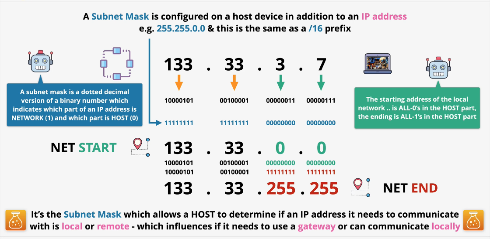
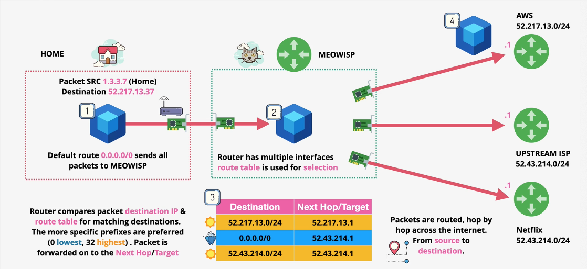
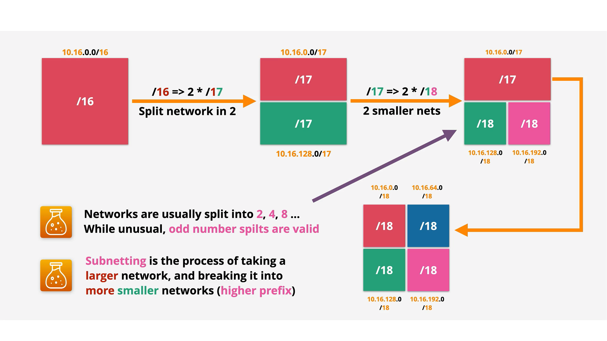

# Tech Fundamentals

## Networking Starter Pack

### OSI 7-Layer Model

[https://en.wikipedia.org/wiki/OSI_model](https://en.wikipedia.org/wiki/OSI_model)

💡 A layer 1 device only understands layer 1 whereas a layer 3 device understands layers 1, 2, and 3

#### Media layers

- Physical, data link, network
- Dealing with how data is moved between point A and point B

#### Host layers

- Transport, session, presentation, application
- How data is chunked/grouped and reassembled as well as formatted so it can be understood

#### Physical (layer 1)

##### Overview

- Transmission and reception of raw bit streams (zeros and ones) between a device and a shared physical medium
- Physical medium can be copper (electrical), fiber (light), or WIFI (radio frequency)
- Defines voltage levels, timing, rates, distances, modulation, and connectors

##### Example: Hubs

- Anything which a hub receives on any port is re-transmitted on all other ports, including errors and collisions
- At layer one, no individual device addresses
- If multiple devices transmit at once, a collision occurs and all information is useless
- No media access control. i.e. cannot control which devices are allowed to transmit
- Collisions are almost guaranteed - likelihood increases with # of devices
- layer 1 cannot detect when collisions occur
- layer 1 networks do not scale well
- no device to device communication
- layer 1 is only practical when layer 2 is added on top

#### Data link (layer 2)

- requires layer 1 (OSI higher layers rely on all layers below itself)
- One of the most critical layers because it supports all data transfer
- Detects and mitigates data collisions
- Data link frame: format for sending information over a layer 2 network
- Layer 2 introduces MAC address: uniquely assigned to a piece of hardware
  - two parts: OUI (manufacturer) and network interface controller (NIC) specific
  - MAC address should be globally unique
- layer 2 networks can only communicate with other layer 2 networks that use the same protocol (e.g. ethernet)
- most common protocol for local networks is ethernet
  - long distance, point to point links use protocols like PPP/MPLS/ATM

##### Frame

- **Preamble:** start of the frame
- MAC header
  - **Destination MAC address**
  - **Source MAC address:** allows it to receive replies
  - **Ether type (ET):** the layer 3 protocol is being used. Example: internet protocol (IP)
- Payload
  - the data being sent via the layer 3 protocol
  - 46-1500 bytes
- Frame check sequence (FCS)
  - Cyclic redundancy check (CRC)
  - Allows destination to check for accidental data errors/changes/corruption

##### CSMA/CD

- carrier sense multiple access (CSMA)
  - check for carrier -> if no carrier, layer 1 takes the frame data and transmits
- collision detection (CD)
  - if collision is detected, a jam signal is sent by all devices and a random backoff occurs. Then it retries. Process repeats, with increasing backoffs, if necessary.
- **encapsulation:** wrapping data inside something else (e.g. wrapping data in a frame)
- **Unicast communication:** 1 to 1
- **Broadcase communication**: 1 to all

##### Example: Switches

- Understands layer 2
- maintains a MAC address table and keeps track of addresses attached to which port
- if it receives a frame and **knows** which port the destination address belongs to, it will send it to that port only
- if it receives a frame and **does not know** which port the destination address belongs to, it will send it to all other ports
- switches store the frame, forward it, and then discard it
- switches do not forward collisions so each port is a separate collision domain which reduces collisions

#### Network (layer 3)

- Internet protocol (IP) is a layer 3 protocol
  - add cross-network IP addressing and routing between LANs without direct P2P
- routers are L3 devices that remove frame encapsulation and add new frame encapsulation at every hop
- packets can be delivered out of order -> need layer 4 for this
- cannot handle different channels of communication -> need layer 4 for this
- no flow control - if dest device is slower, packet loss occurs

##### L3 IP packet structure

- destination and source addresses don't have to be in the same LAN like with L2
- the frame changes for each LAN the frame is moving through
  - **the packet doesn't change!**

##### IPv4 packet

packet fields (only a subset that is relevant right now)

- source and destination IP addresses
- data: from layer 4 protocol
- protocol: ICMP (1), TCP (6), UDP (17)
- Time to live (TTL): max number of hops the packet can take before being discarded

IP addressing

- dotted decimal notation
  - e.g. 127.0.0.1
  - 4 decimals 0-255
  - all IP addresses have a network and a host part
    - the prefix (e.g. /24, /16) determines which is the network part and which is the host part
  - two IP addresses are on the same IP network if the network part is the same
- subnet mask determines if the IP address is local or remote
  - if remote, it needs to use the default gateway

##### IPv6 packet

packet fields (subset)

- source and destination IP addresses (bigger, more possible addresses)
  - more space taken in the packet
- data: from layer 4 protocol
- Hop limit: max number of hops the packet can take before being discarded

##### Route tables & routes

- routers have one to many route tables
  - a route table consists of a destination and the next hop/target to get there (e.g. the gateway to the network)
- router chooses the most specific destination route
  - that means whichever matches and has the highest prefix number because there are fewer host IP addresses
- route tables have a default route that matches if nothing else does
- border gateway protocol (BGP) allows routers to communicate to each other networks they know
- routers wrap packets in frames and forward at layer 2

##### Address resolution protocol (ARP)

- convert IP to MAC
- needed because local network data is moved via L2 frames over L1
- broadcasts to other devices: who has x.x.x.x IP address? ARP on other device responds with MAC address

#### Transport (layer 4)

Both are built in IP

##### TCP

- slower
- reliable
- bi-directional
- **Segments/TCP header**
  - encapsulated within packets
  - TCP header contents:
    - src port
    - dest port
    - sequence number (for ordering within a connection)
    - acknowledgement (verify received up to a sequence number)
    - flags 'n' things (close conn/sync/data offset)
    - window (# of bytes between ack before sender stops and waits, used by receiving device as a form of flow control)
    - checksum (detect errors)
    - urgent pointer (set so TCP control traffic takes processing priority over other packets)
    - options
    - padding
  - segment also includes the data
- uses random port on client, known port on server

###### TCP Handshake

- client sends SYN segment with start sequence (random #)
- server responds with SYN-ACK segment with server start sequence and sets acknowledge to client start sequence +1
- client sends ACK incrementing sequence header and acknowledgement header fields again

###### TCP Sessions/state

- stateless firewall - doensn't understand state of connection
  - would need rule to allow outbound connection on port ? to ip/port ? and a rule to allow inbound connection from ip/port ? to port ?
  - Example: AWS Network ACL
- stateful firewall
  - sees outbound from port ? to ip/port ? and implicitly allows inbound
  - Example: AWS Security Group

##### UDP

- fast
- less-reliable

#### Session (layer 5)

#### Presentation (layer 6)

#### Application (layer 7)

### Network Address Translation (NAT)

- help with shortage of IPv4 addresses
- some security benefits
- translates private IPv4 to public

#### Static NAT (AWS Internet Gateway IGW)

- 1 private to 1 (fixed) public address
- router (NAT device) maintains a NAT table

#### Dynamic NAT

- 1 private to 1st available public
- used when have many private IPs and more than # of public IPs

#### Port address translation PAT (AWS NATGW)

- many private to 1 public (AWS NATGW)
- most home networks
- uses source (private) IP and source port, public IP and public source port

### IP Addressing & Subnetting

- Class A
  - large networks
  - 0.0.0.0 - 127.255.255.255
  - 1.x.x.x - 127.x.x.x (16,777,216 IPs for each network)
- Class B
  - medium size networks
  - 128.0.0.0 - 191.255.255.255
  - 128.0.x.x - 191.255.x.x (65,536 IPs for each network)
- Class B
  - small networks
  - 192.0.0.0 - 223.255.255.255
  - 192.0.1.x - 223.255.255.x (256 IPs for each network)

#### Private IPs

- RFC1918
- 10.0.0.0 - 10.255.255.255 (1 Class A network)
- 172.16.0.0 - 172.31.255.255 (16 Class B networks)
- 192.168.0.0 - 192.168.255.255 (256 Class C networks)

#### IPv6

- management isn't needed anymore since there are so many IP address

#### Subnetting

### DDoS

- Application layer (HTTP flood)
- Protocol attack (SYN flood)
  - server hangs trying to make handshake with an IP address that was spoofed
- Volumetric (DNS amplification)
  - make large number of DNS requests where source address is IP address of legitimate website
  - client devices need very little processing power for this type of attack

#### How does an attacker do ths?

- Control a network of compromised devices (botnet)
- The botnet client devices make requests are cheap/fast but expensive/computationally intense for servers to handle
